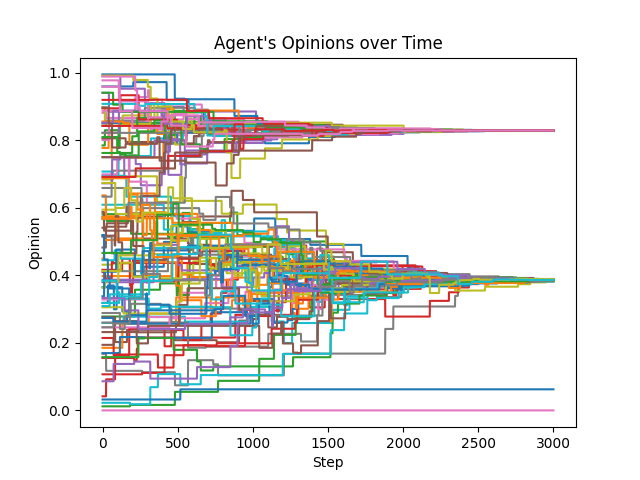

# Agent Based Opinion Model
Random, grid and network structured agent based opinion models

## Setup
`pip install mesa`  
`pip install seaborn`  
`pip install numpy`  
`pip install pandas`  

## Run
Run the server.py file  
`python server.py`  
Once the server started, a new browser tab should open. Click "Start" on the top right.
Each 100 steps a line plot will pop up displaying a lineplot of the agents opinions. Depending on SPACE_TYPE which you can select in the params.yaml, other plots may additionally pop up. The simulation will hault while plots are actively displayed and continue once closed.

Checkout the params.yaml to not only set desired model parameters but also any other simulation configurations.

## TODO
- [x] Implement logic for agents to not move on occupied fields
- [x] Implement logic for agent initialization to only get placed on unoccupied cells
- [x] Implement easy switch between random and grid version (boolean in param.yaml?)
- [x] Better color scheme for grid representation
- [x] Implement logic for agent meetups in grid version
- [x] Implement network version
- [ ] Make initial opinion distribution normal
- [ ] ...

### If time
- [x] Play around with different initial agent position distributions on the grid (e.g.: simulate crowds/cities as clusters)
- [ ] Make dynamic lineplot
- [ ] Increase efficiency by preallocating memory (+ use matrix) for the opinion history.
- [ ] Halt execution when converged